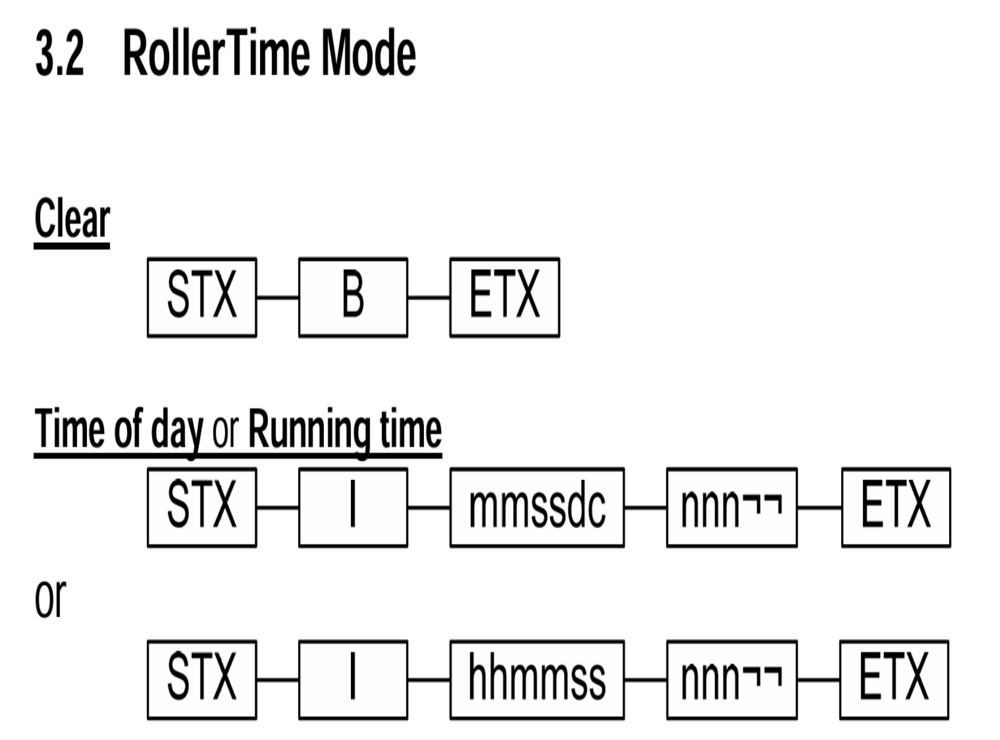
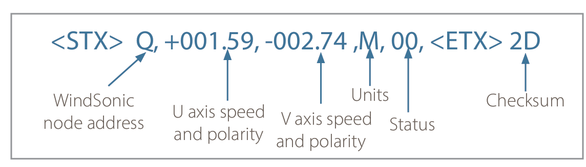
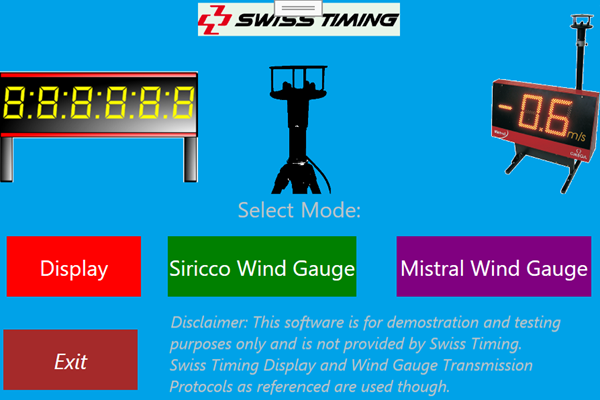
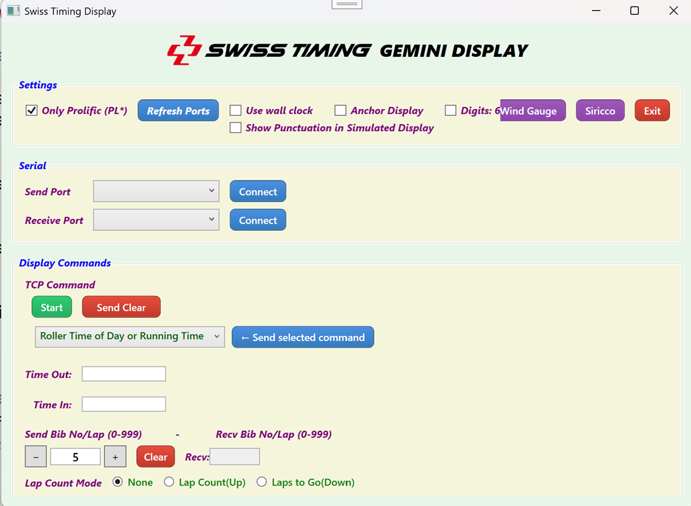
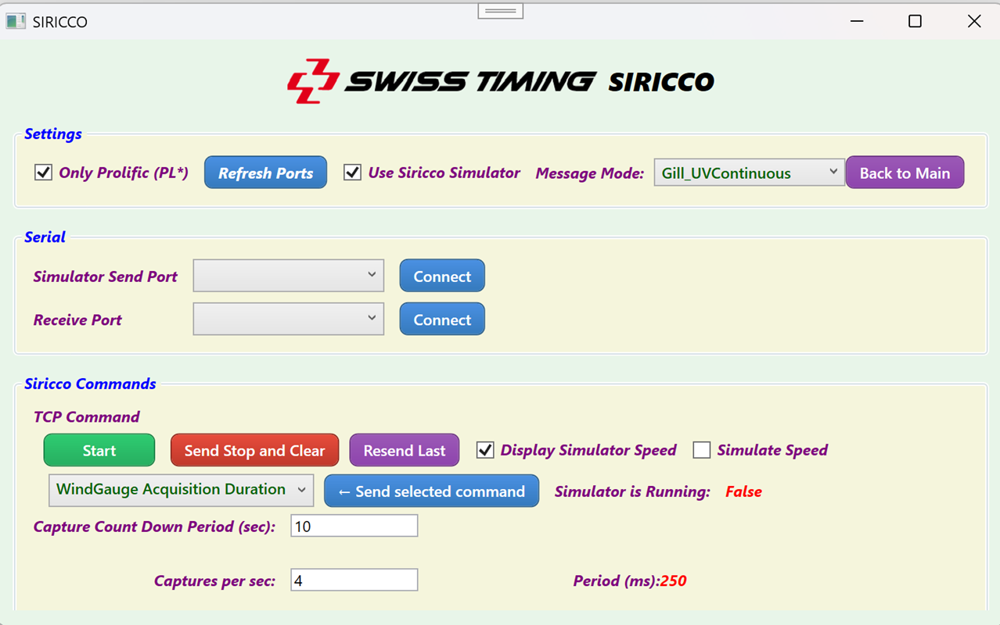
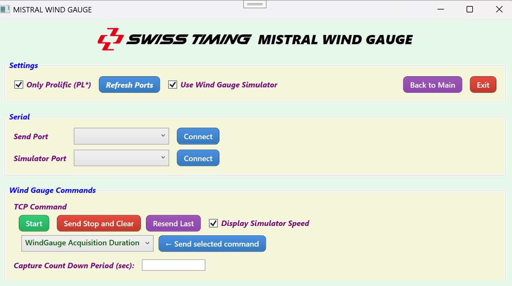
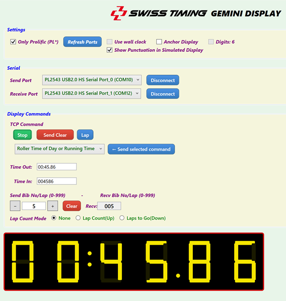
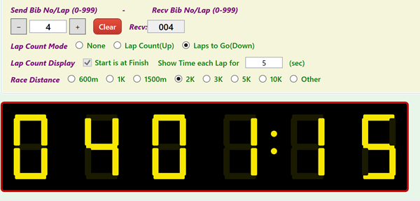
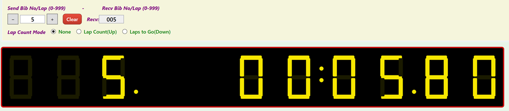

# Swiss Timing 6 Digit (or 3 + 6 Digit) 7 Segment Display + Wind Gauge

<table style="border-collapse: collapse; border: none;">
  <tr style="border: none;">
  <td style="border: none; padding: 0;">
  
  </td>
  <td style="border: none; padding: 0;">
<h2>Version: 3.0.0</h2>
</td>
</tr>
</table>

> ***Nb:***  Have merged Siricco branch back into main  
>  ***Also:*** There are now a self contained Release available.

> **Disclaimer:** _This software is for demostration and testing purposes only and is not provided by Swiss Timing._  
> _Swiss Timing Display and Wind Gauge Transmission Protocols as referenced are used though._

## About
This is a WPF app that can generate display timing messages for a Swiss Timing Gemini 6 Digit 7 segment display, functioning for example, as a running clock or elapsed race time for Athletics events. Messages are sent via the selected Serial-Send port.

Times (wallclock or race running time) are also displayed in a simulated 6 x 7 Segement display in-app. When the Serial-Receive port is not connected, that display displays the transmitted time.

The capability for receiving messages as sent and displaying the received times has also been added so that a loopback cable can be used for testing. To enable serial reception,the Serial-Receive and Serial-Send ports are connected and as such the sent then received data is displayed in-app in the 7 segments rather than the transmitted data ditrectly. In this mode,the app can simulate the physical display.

The app can also run in a mode where it can receive wind speed data from a Swiss Timing Wind Gauge (Sirrico or Mistral) and display the wind speed in the app. There is also a simulator for both wind gauges that can be used to test the app without the actual wind gauge connected. The app can also send back the wind speed to the simulator or actual wind gauge.

---

## The Equipment

  

***6 and 9 digits Swiss Timing displays.***   
_Whilst there is some implementation for the 9 digit display, only the 6 digit display is fully impelmeneted and tested\ here._


<table style="border-collapse: collapse; border: none;">
  <tr style="border: none;">
    <td style="border: none; padding: 0; text-align: center;">
      
    </td>
    <td style="border: none; width: 40px;"></td>
    <td style="border: none; padding: 0; text-align: center;">
      
    </td>
  </tr>
  <tr style="border: none;">
    <td style="border: none; padding-top: 6px; text-align: center;">
      <strong>Siricco Wind Gauge</strong>
    </td>
    <td style="border: none; width: 40px;"></td>
    <td style="border: none; padding-top: 6px; text-align: center;">
      <strong>Mistral Wind Gauge</strong>
    </td>
  </tr>
</table>  

_Sirrico Wind Gauge has been tested whereas Mistral Wind Gauge is yet to be tested with teh software._

---

## Links


---

## Status

### With Hardware
>   As per [MVACDisplayandWindGaugeCabling](/SwissTimingDisplay/docs/MVACDisplayandWindGaugeCabling.pdf) diagram
> - Display functionality has been successfully tested in the fieldwith a Gemini 6 Digit 7 Segment Display
> - Wind Gauge has been successfully tested in the field with a Siricco Wind Gauge.
> - Mistral Wind Gauge has not yet been tested in the field.

### With Simulator
> All 3 simulators work OK :construction_worker:   

Use a loopback cable between 2 ports on the same INT131 to test the app with the simulators.  
Can use RS232 or RS422/485 ports on the INT131 (Have tested OK with both)

---
## Connectivity and Power
***The display is a data sink whereas the wind gauge is a data source.***  
As per [MVACDisplayandWindGaugeCabling](/SwissTimingDisplay/docs/MVACDisplayandWindGaugeCabling.pdf) diagram 
There are 2 RS422/485 sockets either side of the finish line with male 7 pin Tuchel sockets.
> - The display takes power from infield mains via a mains power cable.  
> - The Sirrico Wind Gauge takes power from the INT131 via the RS422/485 port from Pin

- NB There is a local issue (at MVAC) with inground wiring (under the finish line) in that only one of INT131 power pins (pins 1 & 2) on both RS422/485 ports is connected under the finish line.  
  - Only the RS422/485 Pin 2 is connected from outside to inside whereas the wind gauge requires power from pin 1. 
  - A Special RS424/485 inline cable was developed to fix this which is connected betwenn the reel and the Sirrcco Wind gauge cable.
    - Connected pin 2 of the female to pin 1 of the male
    - Female end of this cable connects to the infield socket and the male end connects to the reel.
  - Not an issue with the Display.

## Protocols

### Gemini 6 Digit 7 Segment Display

  

- The first 3 character command clears the display.  
- The second 15 character command displays the event running time:  
  - Min Min : Sec Sec . Hundth Hundth  
- The third 15 character command displays the wallclock time.  
- _nnn is 3 characters for event number or placing but is ignored by 6 digit display._  
- _The other 3 characters are spaces._


### Sirrico Wind Gauge
> Have implemented Gill WinSonic protocol for Siricco with simulator.

6.2. Gill format – UV  <-- Sirrico Uses this mode
In this mode, the output is given as signed (i.e., positive, or negative) speeds along the 
‘U’ (= South – North) axis and the ‘V’ (= East – West) axis. 



With the wind gauge correctly positioned, the U axis is aligned with the track and the V axis is perpendicular to the track, so the software uses the U axis speed as the wind speed. The V axis speed is not used.

### Mistral Wind Gauge

See the end of this document. Unlike the Sirrico Wind Gauge, the Mistral one has input as setup commands as well as output of the wind speed.

---

## Actual display running

 


 

 ## The App

  
 ***The Splash Screen***

  
 ***The Display Screen***

  
 ***The Sirrico Wind Gauge Screen***

  
 ***The Mistral Wind Gauge Screen***


 ## The Simulators

   
 ***Display Simulator for race time 6: MM:SS.HH***

   
 ***Display Simulator 6: LL MM:SS***  
 LL = Laps to go

  
***Display Simulator 9: LLL MM:SS:HH***
   

   

 ***Wind Gauge Simulator***  


## Some previous history of the app
- There is now a **Cosmetic** state variable that if true, the app adds appropiate colon/s and dot between digits in the simulated display for the selected time format. 
  - If Receive port not connected then Cosmetic checkbox does not show.
    - 7 Segement display shows the Sent data (Time out) directly.
    - Colon/s and dot show as per the Sent Data format
  - If Receive port is connected then Cosmetic checkbox shows
    - If not selected then no colons/dot show on the receive display. 
      - HHMMSS/MMSSDD checkbox does not display. 
    - If selected then HHMMSS/MMSSDD checkbox shows which determines the displayed time format:
      - HHMMSS/MMSSDD selection determines what separators show on the receive display.
      - Note that selecting Wallclock triggers this to select HHMMSS. 
- Selected ports are now persisted as well as other app settings
- 3 + 6 Digit display now works.
  - 3 left most digits can display Bib Number, Event No or Lap Count etc. 
  - Note that the 3 digit display is not intended for use with the Gemini 6 Digit Gemini display.
- Added [Lap]/[Continue] button that captures race elapsed time whilst clock continues in background. Can continue.
  - Also have lap up and down count options
- If both persisted COM ports exist autoconnect.
- Clear timing button added and resolved.
- In 6 Digit Mode can display LLMMSS meaning lap as first 2 digits
  - ***Nb:*** _(2Do)_ This works in simulator ~~but not in actual display~~
  - **Update** This should now work in Gemini display:
  ```
  02  49 30 39 30 30 30 34 30 30 39 20 20 03  <- Sent/Recvd Bytes
  STX I  09    00    04    009      sp sp ETX <- Interpretation
  ```
  - 09 and 009 are lap count in 2 and 3 digit format respectively.
    - 09 format is what is displayed in 6 digit display as LL
    - 009 would be used by 9 digit display.
  - 00 04 is  00:04  as MMSS
  - Requires not Wallclock, Cosmetic and Downcounter modes
  - Option **Start at Finish** means if not selected then first [Lap] does not decrement the lap
    - Eg 5K, 3K and 1500m where start is as 200m or 300m
  - When [Stop] pressed displays MMSSDD
  - Now can select how long lap time is displayed for before reverting to elapsed time.
- Spruced up the layout
  - And added Race distance selection which sets the laps to go for DownCount mode
  - And added Start at Finish option for DownCount mode which is set or cleared appropriately.
    - If clear then first lap does not decrement the lap count as per 5K, 3K and 1500m where start is as 200m or 300m 
    - For example, at start of 1500m is Laps set to 3 laps to go so and only decrements when leader passes start second time.
- Wind Gauge
  - V1.4.1 Kill either Window by clicking on the Window X top right completely kills the app.
  - V1.4.2 Write back of speed from simulator works.
    - Various Selections persisted
      - Eg Can hide simulator, display simulator speed directly or only once "returned".
    - Connection state persisted issues to resolve
    - Need to check with display that these changes haven't caused issues. 2Do
    - Not tested with actual Wind Gauge yet, simulator only. 2Do
  - 1.9.8: Preview of version 2.0.0 Splash sceen at app start and various settings are persisted including serial connections.
    - Next to test on actual Wind Gauge, next week.
  - 1.9.8.1: Spruced up Splash screen. Tidied up code.
- 2.0.0: Completed Display fixes. 
  - Wind Gauge waits test with actual Mistral Wind Gauge.
- 2.0.1: Display Time displayed MM:SS:DD is not from timer 
    - but from difference between system tics at start and at end.
    - Much more accurate, not subject to latency of timer.
>Nb: Re ticks resolution:
```
Is StopWatch time resolution normal be available on windows machines?
Yes, Stopwatch.IsHighResolution is typically true on Windows machines. Windows has a high-resolution performance counter (QueryPerformanceCounter API) that Stopwatch uses by default.

Current implementation use this:

The current code uses _raceStopwatch.ElapsedTicks - _startTicks, which already uses the best available timer:

If high-resolution is available (typical on Windows): Uses the performance counter with ~0.1-1 microsecond precision
If not available: Automatically falls back to the system timer
No need to add conditional logic:

The Stopwatch class handles this internally. You don't need to check IsHighResolution and switch to System Ticks manually. The current implementation is already correct and will use the highest precision available on the system.

Your current code is fine as-is:
```
```csharp
var elapsedTicks = _raceStopwatch.ElapsedTicks - _startTicks;
var elapsed = TimeSpan.FromTicks(elapsedTicks);
//This will automatically use the high-resolution timer on Windows, giving you sub-millisecond accuracy for the MM:SS.DD display when stopped.
```

## Hint
For testing using one INT31:
- Connected INT131 to the PC USB port
- Connected a standard null modem cable between the 2 INT131 RS232 (DB9) ports. 

## Related Documents
- [INT31 Manual](SwissTimingDisplay/docs/INT131.pdf)
- [Gemini 6 Digit  7 Segment Display Manual](SwissTimingDisplay/docs/SwissTimingGeminiDisplay.pdf)
- [MVAC Track Setup](SwissTimingDisplay/docs/MVACDisplayandWindGaugeCabling.pdf)
- [Mistral Wind Gauge Manual](https://www.swisstiming.com/fileadmin/Resources/Instruction_Manuals/3436.500.02_Mistral_User_Manual.pdf)
- [Sirrico Wind Gauge](https://www.swisstiming.com/fileadmin/Resources/Instruction_Manuals/3436.501.02_Sirocco_User_Manual.pdf)

## The App


  

**_The app displaying sent wallclock time_** 

## RollerMode Commands


## Mistral Wind Gauge Commands


Also see [Models/CharCommand.cs](SwissTimingDisplay/Models/CharCommand.cs)

